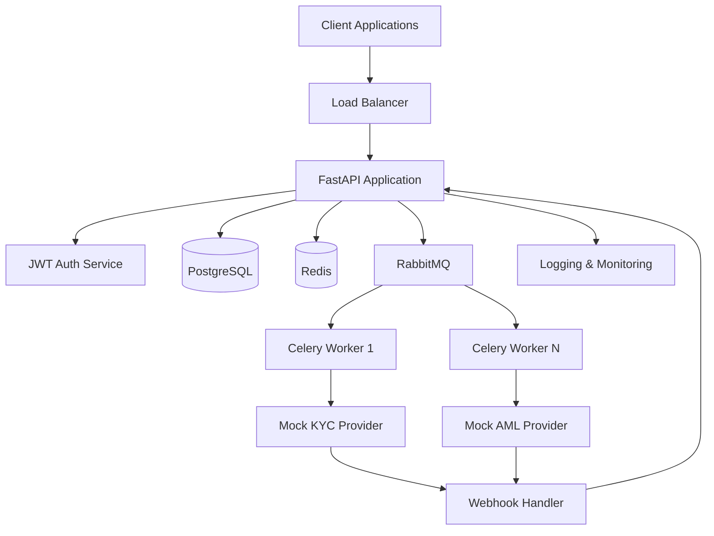
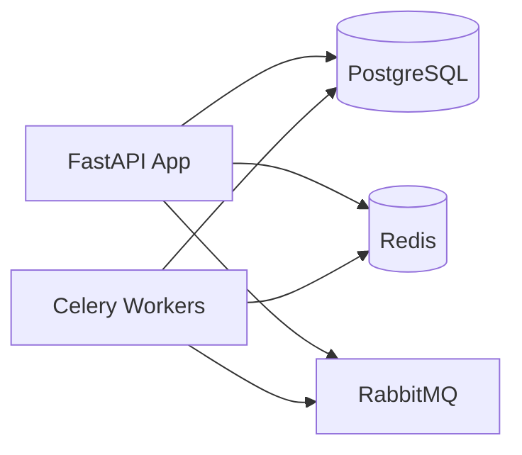

# Design Document

## Overview

The KYC/AML microservice is designed as a production-ready FastAPI application that simulates real-world fintech verification workflows. The architecture follows microservice principles with clear separation of concerns, asynchronous processing, and robust security measures. The system uses mock providers to demonstrate integration patterns without requiring paid third-party services.

## Architecture

### High-Level Architecture



### Service Layers

1. **API Layer**: FastAPI application handling HTTP requests
2. **Business Logic Layer**: Core KYC/AML processing logic
3. **Data Access Layer**: Repository pattern for database operations
4. **Integration Layer**: Mock provider interfaces and webhook handlers
5. **Infrastructure Layer**: Authentication, caching, and messaging

## Components and Interfaces

### Core Components

#### 1. User Management Service
- **Purpose**: Handle user registration, authentication, and profile management
- **Key Methods**:
  - `create_user(user_data: UserCreate) -> User`
  - `authenticate_user(credentials: UserCredentials) -> TokenResponse`
  - `get_user_profile(user_id: str) -> UserProfile`

#### 2. KYC Verification Service
- **Purpose**: Orchestrate KYC verification workflows
- **Key Methods**:
  - `initiate_kyc_check(user_id: str, documents: List[Document]) -> KYCCheck`
  - `get_kyc_status(check_id: str) -> KYCStatus`
  - `update_kyc_status(check_id: str, status: KYCStatusEnum, details: dict)`

#### 3. Webhook Handler Service
- **Purpose**: Process incoming webhooks from mock providers
- **Key Methods**:
  - `verify_webhook_signature(payload: bytes, signature: str, provider: str) -> bool`
  - `process_kyc_webhook(payload: KYCWebhookPayload) -> None`
  - `handle_webhook_retry(webhook_id: str) -> None`

#### 4. Mock Provider Service
- **Purpose**: Simulate external KYC/AML provider behavior
- **Key Methods**:
  - `submit_kyc_check(documents: List[Document]) -> ProviderResponse`
  - `simulate_processing_delay() -> None`
  - `generate_mock_result() -> KYCResult`

### API Endpoints

#### Authentication Endpoints
- `POST /auth/register` - User registration
- `POST /auth/login` - User authentication
- `POST /auth/refresh` - Token refresh

#### KYC Management Endpoints
- `POST /kyc/checks` - Initiate KYC verification
- `GET /kyc/checks/{check_id}` - Get KYC status
- `GET /kyc/checks` - List user's KYC checks (paginated)
- `PUT /kyc/checks/{check_id}` - Update KYC check (admin only)

#### User Management Endpoints
- `GET /users/profile` - Get user profile
- `PUT /users/profile` - Update user profile
- `GET /users/{user_id}/kyc` - Get user KYC history (admin only)

#### Webhook Endpoints
- `POST /webhooks/kyc/{provider}` - Receive KYC webhooks
- `POST /webhooks/aml/{provider}` - Receive AML webhooks

#### Health & Monitoring Endpoints
- `GET /health` - Health check
- `GET /metrics` - Prometheus metrics

## Data Models

### Core Entities

#### User Model
```python
class User:
    id: UUID
    email: str
    first_name: str
    last_name: str
    date_of_birth: date
    phone_number: str (encrypted)
    address: Address
    created_at: datetime
    updated_at: datetime
    is_active: bool
    role: UserRole
```

#### KYC Check Model
```python
class KYCCheck:
    id: UUID
    user_id: UUID
    status: KYCStatusEnum  # pending, in_progress, approved, rejected, manual_review
    provider: str
    provider_reference: str
    documents: List[Document]
    verification_result: dict
    created_at: datetime
    updated_at: datetime
    completed_at: Optional[datetime]
    notes: Optional[str]
```

#### Document Model
```python
class Document:
    id: UUID
    kyc_check_id: UUID
    document_type: DocumentType  # passport, driver_license, utility_bill
    file_path: str
    file_hash: str
    document_number: str (encrypted)
    expiry_date: Optional[date]
    uploaded_at: datetime
```

#### Webhook Event Model
```python
class WebhookEvent:
    id: UUID
    provider: str
    event_type: str
    payload: dict
    signature: str
    processed: bool
    processed_at: Optional[datetime]
    retry_count: int
    created_at: datetime
```

### Database Schema Design

#### Encryption Strategy
- **Field-level encryption** for sensitive data (passport numbers, phone numbers)
- **Encryption key rotation** support
- **Audit trail** for all data access

#### Indexing Strategy
- Primary keys on all UUID fields
- Composite index on `(user_id, created_at)` for KYC checks
- Index on `status` for efficient status queries
- Index on `provider_reference` for webhook lookups

## Error Handling

### Error Categories

1. **Validation Errors** (400)
   - Invalid input data
   - Missing required fields
   - Format validation failures

2. **Authentication Errors** (401/403)
   - Invalid JWT tokens
   - Insufficient permissions
   - Expired tokens

3. **Business Logic Errors** (422)
   - KYC check already exists
   - Invalid status transitions
   - Document validation failures

4. **Integration Errors** (502/503)
   - Mock provider unavailable
   - Webhook processing failures
   - Queue connection issues

5. **System Errors** (500)
   - Database connection failures
   - Encryption/decryption errors
   - Unexpected exceptions

### Error Response Format
```json
{
  "error": {
    "code": "VALIDATION_ERROR",
    "message": "Invalid document format",
    "details": {
      "field": "document_type",
      "reason": "Must be one of: passport, driver_license, utility_bill"
    },
    "request_id": "req_123456789"
  }
}
```

### Retry and Circuit Breaker Patterns
- **Exponential backoff** for webhook retries
- **Circuit breaker** for mock provider calls
- **Dead letter queue** for failed messages
- **Idempotency keys** for webhook processing

## Testing Strategy

### Unit Testing
- **Service layer tests** with mocked dependencies
- **Repository tests** with test database
- **Utility function tests** for encryption/validation
- **Mock provider tests** for simulation logic

### Integration Testing
- **API endpoint tests** with test containers
- **Database integration tests** with PostgreSQL test instance
- **Queue integration tests** with RabbitMQ test instance
- **Webhook flow tests** end-to-end

### Contract Testing
- **API contract tests** using OpenAPI specifications
- **Webhook contract tests** for provider integrations
- **Database schema tests** for migration validation

### Performance Testing
- **Load testing** for API endpoints
- **Stress testing** for queue processing
- **Database performance tests** for query optimization

### Security Testing
- **Authentication tests** for JWT validation
- **Authorization tests** for role-based access
- **Encryption tests** for data protection
- **Webhook signature tests** for security validation

## Security Considerations

### Authentication & Authorization
- **JWT tokens** with short expiration times
- **Refresh token rotation** for enhanced security
- **Role-based access control** (RBAC)
- **API rate limiting** to prevent abuse

### Data Protection
- **Field-level encryption** for PII data
- **Encryption at rest** for database storage
- **TLS encryption** for data in transit
- **Secure key management** using environment variables

### Webhook Security
- **HMAC signature verification** for webhook authenticity
- **Timestamp validation** to prevent replay attacks
- **IP allowlisting** for known providers
- **Request size limits** to prevent DoS attacks

### Audit & Compliance
- **Comprehensive logging** of all operations
- **Audit trails** for data access and modifications
- **GDPR compliance** features (data export/deletion)
- **Regulatory reporting** capabilities

## Deployment Architecture

### Container Strategy
- **Multi-stage Docker builds** for optimized images
- **Non-root user** execution for security
- **Health checks** for container orchestration
- **Resource limits** for predictable performance

### Service Dependencies


### Environment Configuration
- **Development**: Single-node Docker Compose
- **Staging**: Multi-container with external databases
- **Production**: Kubernetes with managed services

### Monitoring & Observability
- **Structured logging** with correlation IDs
- **Prometheus metrics** for monitoring
- **Health check endpoints** for load balancers
- **Distributed tracing** for request flows